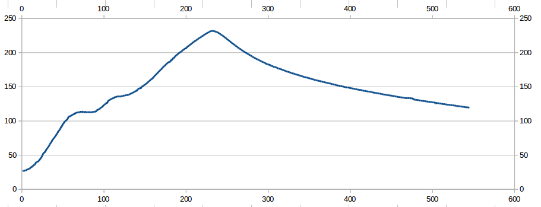

# CLAUDE.md

## Project type

Arduino sketch (`Reflow_Oven.ino`). There is no Makefile or CLI build — compile and upload via the Arduino IDE or `arduino-cli`. Do not attempt to run `make`, `cmake`, or similar tools.

## Key file

`Reflow_Oven.ino` — the entire firmware. There is only one source file.

## Architecture

Event-driven state machine running in `loop()`. Two periodic timers drive everything:

- **`nextRead`** (every 1 s) — reads the thermocouple via `thermocouple.readCelsius()`
- **`nextCheck`** (every 1 s) — increments `timerSeconds`, logs to Serial, refreshes the OLED

The SSR is driven by time-proportional (window) PID at the bottom of `loop()`. The window is 2000 ms. PID tunings are swapped at each stage transition (preheat → soak → reflow).

## Hardware dependencies

All I/O is tightly coupled to fixed pin numbers at the top of the file. Any pin changes must be reflected there. The SSD1306 display is on I2C (A4/A5); its address is `OLED_ADDRESS` (0x3C — change if your module uses 0x3D).

## Start button

Pin 7 is the start button (`INPUT_PULLUP`, active low — connect to GND). The reflow cycle only begins when the button is held while the oven is in `REFLOW_STATE_IDLE` and below 50 °C.

## Solder profile

Non-RoHS (leaded) constants are currently active. RoHS values are present but commented out near the top of the file. Never have both sets uncommented simultaneously.

## Testing

There is no test suite. Verify changes by:
1. Checking that the sketch compiles without errors or warnings in the Arduino IDE.
2. Monitoring Serial output (57600 baud) during a live run to confirm the temperature profile looks correct.
